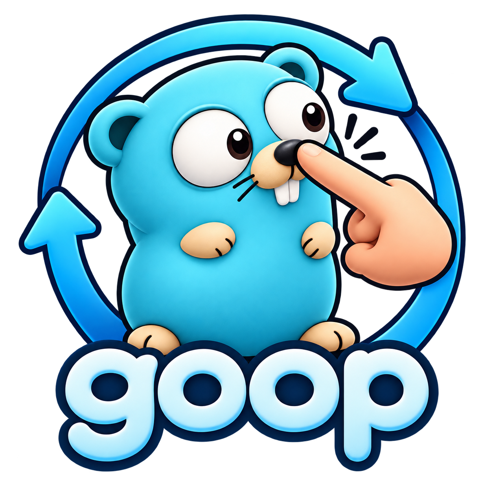

<p align="center">
  
</p>

# goop

A minimal tool-using agent loop for Go, standard library only. Give it a
provider, a model and some Go functions; it streams the answer, runs the tools
the model asks for and loops until the model is done.

## Example

```go
weather, _ := goop.NewTool("get_weather", "Look up the weather in a city.",
	func(ctx context.Context, in struct {
		City string `json:"city" desc:"the city to look up"`
	}) (string, error) {
		return `{"temperature_c":18,"conditions":"light rain"}`, nil
	})

agent := &goop.Agent{
	Provider: &goop.Anthropic{APIKey: os.Getenv("ANTHROPIC_API_KEY")},
	Model:    "claude-sonnet-5",
	Tools:    []goop.Tool{weather},
}

var conv []goop.Message
for ev, err := range agent.Run(ctx, conv, goop.Text{Text: "Will it rain in Paris?"}) {
	if err != nil {
		log.Fatal(err)
	}
	switch e := ev.(type) {
	case goop.TextDelta:
		fmt.Print(e.Text)
	case goop.Done:
		conv = e.Messages // pass back in to continue the chat
	}
}
```

## Features

| Feature | How |
| --- | --- |
| Streaming events | `Agent.Run` yields `TextDelta`, `ThinkingDelta`, `ToolCall`, `ToolReturn`, then one `Done` or one error |
| Typed tools | `NewTool` builds the JSON schema from a Go struct: `json` names, `desc` descriptions, pointer / `omitempty` / `omitzero` fields optional |
| Input validation | Unknown or missing required fields go back to the model as an error; the tool never runs |
| Tool errors | Returned errors and panics become error results the model can react to |
| Approval hook | `OnToolCall` can inspect, rewrite or refuse any call |
| Limits | `MaxTurns` (default 10) and `Budget` (total tokens) return a `LimitError` that keeps the conversation |
| Retries | 408, 429 and 5xx with backoff and `Retry-After`; `HTTP.MaxRetries`, default 2 |
| Safe streams | A dropped connection is `ErrTruncatedStream`, never a half answer |
| Cancellation | Breaking out of the `range` loop cancels the request |
| Jev | `Jev.Gate` approves tool calls with TypeSafe's System One model; `Jev.Tool` lets the model ask it |

## Providers

| | `Anthropic` | `OpenAIResponses` | `OpenAI` |
| --- | :---: | :---: | :---: |
| API | Messages | Responses | Chat Completions, plus compatible servers (OpenRouter, LM Studio, Ollama, …) |
| Images | ✓ | ✓ | ✓ |
| Documents (PDF) | ✓ | ✓ | – |
| Streamed reasoning | ✓ | ✓ summaries | ✓ where the server sends it |
| Reasoning kept across tool calls | ✓ | ✓ encrypted, `store:false` | – |
| Prompt caching | ✓ automatic breakpoints | server side | server side |
| Options | `Thinking` | `ReasoningEffort` | `ReasoningEffort`, `LegacyMaxTokens` |

Every provider takes `APIKey`, `BaseURL` and `HTTP`. Swapping one for another
changes nothing else.

## Try it

```bash
cp cmd/try/.env.example cmd/try/.env   # set GOOP_PROVIDER and GOOP_API_KEY
go run ./cmd/try "Will it rain in Paris?"
go run ./cmd/try                        # REPL; ctrl-c stops a turn, ctrl-d quits
```
